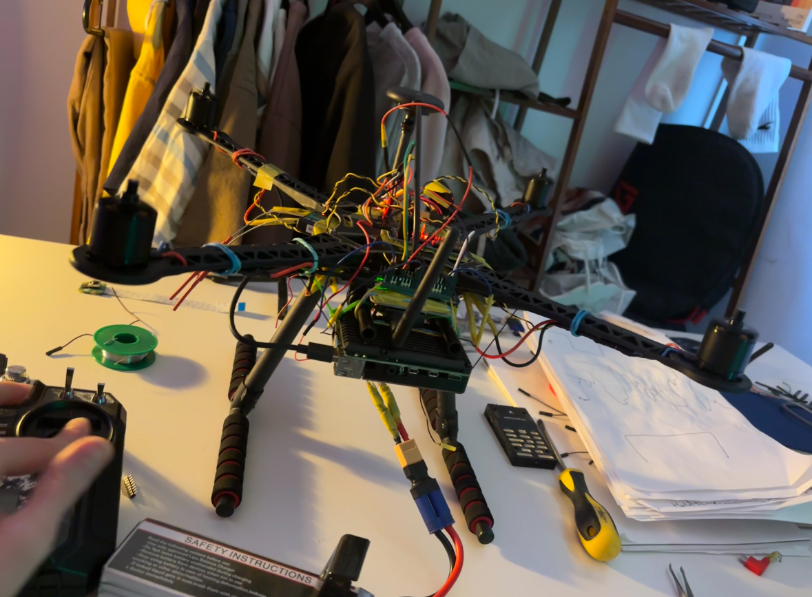
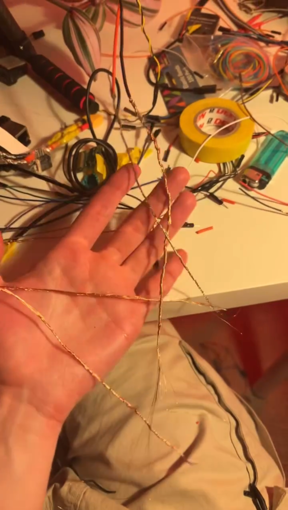
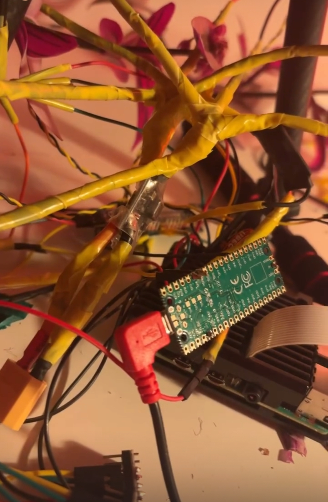
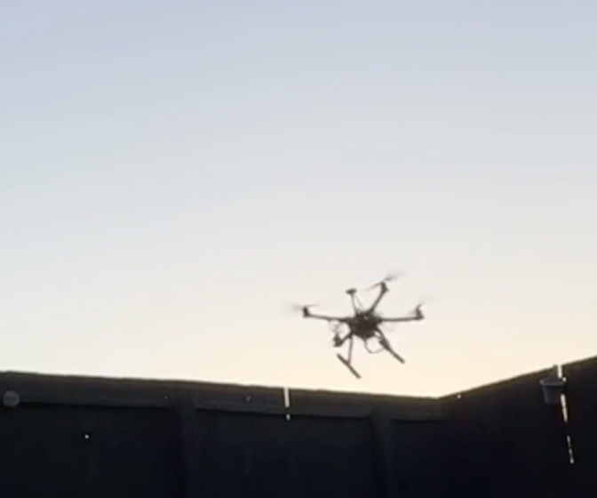

# Engineering a Drone Flight Controller
I worked on this project between February to early-April 2025. I developed a fascination for embedded programming and set out to implement a perception-to-action flight model on a drone running my own flight controller firmware. While I only managed a single, brief, maiden flight in this time, I learned so much and deeply enjoyed doing so. Note: I had **very** limited resources for this project.

This repository contains the embedded firmware for a custom quadcopter drone, written in C++ and designed to run on the Raspberry Pi Pico (RP2040) microcontroller. The project was developed as a self-directed systems engineering exercise in low-level control loops, real-time sensor fusion, and telemetry-driven feedback. The firmware was successfully tested on a partially salvaged Holybro S500 V2 frame with custom braided copper power wiring—

—and custom-built power circuitry:

 

## Maiden Flight 
The drone flew untethered during its maiden test before triggering my overtilt-safety cutoff. A short [telemetry log](./lib/maiden_flight.md) is included.

A video and photo of the flight are available in the lib/ directory (this was a special moment!).

 

(volume warning!)

## Ground Control Station 

Terminal-based real-time telemetry parser and state monitor for autonomous flight experiments

### Overview
This module forms the ground control interface for a custom quadcopter drone project. Written in C++ and designed to run on a Raspberry Pi (or similar Linux-based system), it connects to the drone over UART and interprets live telemetry frames sent from the onboard flight controller (running on a Raspberry Pi Pico).

This implementation prioritizes minimal latency, code transparency, and terminal-friendly feedback. The code was part of a larger embedded systems engineering project that involved custom drone construction, real-time sensor fusion, and manual PCB-level integration.

### ./src/

- main.cpp:	Launches the ground control terminal interface. Initializes and supervises the Receiver class, handling graceful shutdown on interrupt. Acts as the entry point for the monitoring software. 
- receiver.cpp:	Manages serial input via UART (e.g., from the drone). Parses incoming telemetry data at 57600 baud, prints to console with ANSI styling, and handles interrupt signals.

### ./include/ 

- receiver.h	Declares the Receiver class. Encapsulates state management and parsing logic for UART telemetry from the drone. Implements a singleton pattern to coordinate signal handling. 
- shared_state.h	Shared global state used across modules (e.g., std::atomic<bool> online). Used to communicate shutdown signals across threads safely.

### lib/	

Contains project media, telemetry logs, and photos. Includes a thumbnail image and maiden flight .mp4 for README embedding.

### onboardController/	

Firmware for the embedded flight controller (RP2040). Contains C++ source and headers organized under src/ and include/, with a CMakeLists.txt for building. 

### Features
UART serial communication using /dev/ttyUSB0

Real-time telemetry parsing and printing

Signal-aware loop with graceful SIGINT interrupt handling

Status-based output with ANSI terminal colouring

Modular Receiver class with persistent state

Simple multithread-safe control loop via std::atomic<bool>

### Running the Ground Station
Make sure your user has permission to access /dev/ttyUSB0 (or appropriate device).
You can build with:

g++ -std=c++17 -pthread main.cpp receiver.cpp -o groundstation
./groundstation

#### Interrupt with CTRL+C to shut down cleanly.

### Expected Output
If telemetry is flowing properly from the drone:

Ground control online...

Receiver state: ONLINE

Successfully opened file descriptor!

Parsing incoming signal...

roll=0.02,pitch=-0.01,yaw=0.03,...

The Receiver class parses key-value telemetry frames and prints them directly with terminal coloring.

### Integration with Drone Firmware
The [onboard flight controller](./onboardController/README.md) sends telemetry frames (e.g., roll, pitch, yaw, altitude, voltage, PID errors) over UART. This station listens, parses, and prints those updates in real time.

Future versions may include: 
- Logging
- Signal quality monitoring
- A minimal dashboard

## Author 
Samuel Clucas 

Durham University – BSc Biological Sciences (First Class) 

Incoming MRes – Biomedical Data Science, Imperial College London 
